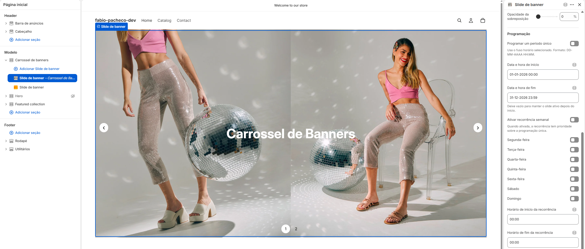

# RecurringBanners (Shopify) — Carrossel de banners recorrentes

> Seção para temas Shopify Online Store 2.0 que exibe banners com mídia responsiva, controles do Splide e programação pontual ou recorrente.

## 📸 Preview

*Editor visual da Shopify com o carrossel de banners e as configurações de programação do slide.*

## ℹ️ Informações Gerais

> Detalhes fundamentais sobre a localização técnica e responsabilidades da feature.

| Campo | Descrição |
| :--- | :--- |
| **Nome do(s) componente(s)** | `reusable-banner` | `ReusableBannerSplide` |
| **Diretório(s)** | `sections/reusable-banner.liquid` | `assets/` |
| **Plataforma** | Shopify Online Store 2.0 |
| **Responsável** | Não informado |

### Arquivos usados

- **Seção Shopify**: `sections/reusable-banner.liquid`
- **Comportamento**: `assets/reusable-banner-splide.js`
- **Estilos do componente**: `assets/reusable-banner-splide.css`
- **Dependência local**: `assets/splide.min.js` e `assets/splide.min.css` (`Splide 4.1.3`)
- **Preview**: `sample.png`

## ⚙️ Props

> A seção não recebe props via React. Suas opções são configuradas no editor visual da Shopify, em configurações da seção e nos blocos de slide.

### Configurações da seção

| Configuração | Tipo | Obrigatório | Descrição |
| :--- | :--- | :--- | :--- |
| `layout` | select | não | Define layout de largura total ou contido. |
| `slide_height` / `custom_height` | select / range | não | Define altura adaptável, preset ou personalizada. |
| `transition` | select | não | Alterna entre `slide` e `fade`. |
| `auto_rotate`, `change_slides_speed`, `loop` | checkbox / range | não | Controla autoplay, intervalo e repetição dos slides. |
| `pause_on_hover`, `pause_on_focus` | checkbox | não | Pausa o autoplay durante interação do usuário. |
| `show_arrows`, `navigation_style` | checkbox / select | não | Exibe setas e define navegação por pontos, números, contador ou nenhuma. |
| `schedule_time_zone` | text | não | Fuso usado no cálculo da programação; padrão `America/Sao_Paulo`. |
| `accessibility_label` | text | não | Rótulo acessível do carrossel. |

### Configurações do bloco de slide

Cada bloco pode configurar mídia, conteúdo, links, botões, posicionamento e programação. Os campos de agendamento são:

- `schedule_enabled`, `schedule_start` e `schedule_end` para um período único.
- `recurring_enabled`, dias da semana, `recurring_start_time` e `recurring_end_time` para recorrência semanal.
- `recurring_start_at` e `recurring_end_at` para limitar a campanha recorrente a uma janela de datas.

## 🚀 Condições de Funcionamento

> Requisitos necessários para que o componente opere corretamente no ambiente.

1. **Tema compatível com Shopify Online Store 2.0**: a seção precisa ser adicionada pelo editor visual do tema.
2. **Arquivos nos caminhos esperados**: preserve a estrutura `sections/` e `assets/` ao copiar o componente.
3. **Assets locais carregados**: a seção carrega o Splide localmente e depende de `splide.min.js`, `splide.min.css`, `reusable-banner-splide.js` e `reusable-banner-splide.css`.
4. **Formato de data e hora**: use `DD-MM-AAAA HH:MM` para datas e `HH:MM` para horários de recorrência.
5. **Mídia externa válida**: vídeos externos devem usar uma URL compatível com YouTube ou Vimeo; vídeos Shopify devem ser selecionados no editor.
6. **Configuração de programação consistente**: um slide recorrente precisa ter ao menos um dia selecionado e horários válidos; o fim da programação deve ser posterior ao início.

## 🛠️ Funcionamento Técnico

> Explicação resumida da arquitetura e fluxo de dados, separando por camadas.

### Liquid / Seção Shopify

- Renderiza o elemento customizado `<reusable-banner>` com atributos `data-*` para as configurações do carrossel e da programação.
- Gera imagens responsivas com `<picture>`, `srcset`, `loading` lazy e prioridade para o primeiro slide ativo.
- Renderiza vídeos Shopify, iframes do YouTube/Vimeo, links, conteúdo, botões, setas e navegação.
- Oculta no servidor os slides recorrentes que não pertencem ao dia atual, exceto quando a prévia da programação está ativa no modo de design.

### JavaScript / Splide

- `reusable-banner-splide.js` identifica os slides ativos conforme data, horário, dia da semana e fuso configurado.
- Slides inativos são removidos temporariamente da lista montada pelo Splide. Quando a programação muda, a instância é recriada com os slides válidos.
- A atualização automática ocorre a cada minuto e respeita intervalos que atravessam a meia-noite.
- Os controles de navegação, autoplay, pausa, teclado e atualização de status são conectados à instância do Splide.

### APIs e dependências

- **Splide 4.1.3**: biblioteca local usada para montar o carrossel e controlar transição, navegação e autoplay.
- **Shopify Liquid**: responsável pela seção, schema, seleção de mídia e geração do markup.
- **Intl.DateTimeFormat**: usado no navegador para calcular a data e a hora no fuso configurado.

## 📖 Instruções de Uso

> Guia passo a passo para configurar e integrar o componente.

### Admin / Configuração

1. Copie os arquivos da seção e dos assets preservando os caminhos indicados em [Arquivos usados](#arquivos-usados).
2. No editor visual da Shopify, adicione a seção **Carrossel de banners**.
3. Escolha o layout, a altura, a transição e os controles da seção.
4. Adicione um bloco de slide e selecione imagem desktop/mobile ou vídeo.
5. Configure título, descrição, link da mídia, botões, cores e posicionamento do conteúdo.
6. Para programação pontual, ative **Programar um período único** e informe início e fim.
7. Para recorrência, ative **Ativar recorrência semanal**, selecione os dias, informe os horários e, se necessário, delimite a campanha com as datas de início e fim.
8. No modo de design, use a prévia da programação para validar o resultado em uma data e hora específicas.

### Desenvolvimento / Código

1. Mantenha os cinco arquivos do componente nos diretórios `sections/` e `assets/`.
2. Não substitua os assets locais do Splide por uma versão carregada de outra seção sem validar compatibilidade.
3. Ao incorporar a seção em outro tema, mantenha os atributos e seletores `data-reusable-banner-*`, pois o JavaScript depende deles.
4. Após a instalação, valide no editor visual: mídia desktop/mobile, autoplay, navegação, fallback e transições de programação.

## ❓ Troubleshooting

> Problemas comuns encontrados e suas respectivas soluções.

1. **A seção aparece sem carrossel ou sem controles**
   - **Causa**: algum asset foi copiado para um caminho diferente ou o Splide não foi carregado.
   - **Solução**: confirme os cinco arquivos, a ordem de carregamento feita pela seção e o console do navegador.

2. **Um slide programado não aparece**
   - **Causa**: data/hora inválida, nenhum dia selecionado, fuso incorreto ou intervalo fora da janela configurada.
   - **Solução**: revise os formatos `DD-MM-AAAA HH:MM` e `HH:MM`, o campo `schedule_time_zone` e use a prévia da programação no modo de design.

3. **A recorrência não funciona ao atravessar a meia-noite**
   - **Causa**: o horário final foi configurado como anterior sem considerar que o período continua no dia seguinte.
   - **Solução**: use horários válidos; o componente trata automaticamente intervalos em que o início é posterior ao fim e considera o dia anterior.

4. **O vídeo externo não reproduz automaticamente**
   - **Causa**: navegadores bloqueiam autoplay com áudio ou a URL não é do YouTube/Vimeo.
   - **Solução**: mantenha o vídeo sem áudio para autoplay, valide a URL e confirme as permissões do iframe.

5. **O banner aparece sem imagem**
   - **Causa**: nenhuma mídia foi selecionada para o bloco.
   - **Solução**: selecione uma imagem ou vídeo; sem mídia, o componente exibe o placeholder `hero-apparel-1` do Shopify.
